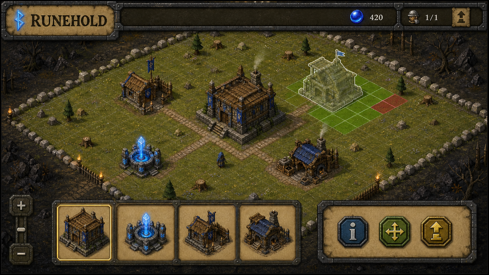

# Direction artistique du village Runehold

## Référence sélectionnée



Le concept fixe la hiérarchie visuelle, pas un écran à recopier pixel par pixel.
La parcelle occupe l'essentiel de la fenêtre, les ressources et le constructeur
restent visibles en haut, la palette de construction est en bas et la sélection
fait apparaître trois actions contextuelles : informations, déplacement et
amélioration.

Cette version est la référence retenue : la barre supérieure est volontairement
réduite à une seule ressource, le mana.

## Principes

- Silhouettes isométriques originales et immédiatement reconnaissables.
- Matériaux médiévaux sobres : chêne usé, pierre calcaire, fer sombre et parchemin.
- Accent magique bleu réservé au mana, aux runes et à l'état sélectionné.
- Proportions trapues, textures peintes et lisibilité proche des jeux du début des
  années 2000, sans reprendre les modèles ou textures OSRS.
- Aucun logo, personnage, bâtiment ou emblème provenant de Clash of Clans ou de
  RuneScape n'est copié dans le dépôt.
- Le vert signifie « placement valide » et le rouge « placement impossible »,
  toujours doublés d'une forme, d'une bordure ou d'un texte accessible.

## Plan des sprites de la première tranche

| Asset | Empreinte | Rôle visuel |
| --- | ---: | --- |
| Hôtel de ville | 4 x 4 | Masse centrale en pierre et bois, bannière runique originale. |
| Puits de mana | 2 x 2 | Cercle de pierre et cristal bleu, source principale de lumière. |
| Caserne | 3 x 3 | Charpente, palissade et bannière, silhouette plus basse. |
| Atelier | 3 x 3 | Toit sombre, cheminée et établi extérieur. |
| Chantier | selon bâtiment | Échafaudage en bois et poussière, superposé au bâtiment. |
| Constructeur | 1 x 1 visuel | Petit artisan encapuchonné, sans ressembler au Builder de Clash. |

Les sprites seront générés ou peints comme assets Runehold séparés sur fond
extractible, puis optimisés en PNG. Le sol, la grille, les cases de validation et
les bordures seront dessinés de manière déterministe par le canvas Swing.

## Frontière des assets OSRS

- La typographie de toute l'interface vient de `FontManager` à l'exécution.
- Les petites icônes fonctionnelles du HUD (mana, construction, combat, atelier)
  peuvent venir de `ItemManager` ou `SpriteManager` à l'exécution.
- Les bâtiments, le terrain, le constructeur, les décors et la marque Runehold
  restent des créations originales empaquetées avec le plugin.
- Aucun PNG ou fichier de police extrait du cache Jagex n'est redistribué. La
  provenance de chaque asset externe est tenue dans `THIRD_PARTY_NOTICES.md`.

## Prompt final du mockup

Le mockup a été généré avec l'outil intégré de génération d'images, puis corrigé
par une édition ciblée de la barre de ressources.

```text
Use case: ui-mockup
Asset type: high-fidelity desktop game plugin interface concept for the RuneLite plugin "RUNEHOLD"
Primary request: Design an original village-builder interface that captures the clear interaction hierarchy of a mobile base-building game while being fully reimagined as an Old School RuneScape-inspired medieval fantasy side game. This is a shippable UI reference, not splash art and not a copy of any existing game.
Scene/backdrop: a large bounded isometric 18-by-18 grassy village plot, enclosed by rough stone border markers and surrounded by dark wilderness; enough empty buildable tiles are visible.
Subject: an original level-1 timber-and-stone Town Hall occupying 4-by-4 tiles at the center, an original glowing blue Mana Well on 2-by-2 tiles, an original small Barracks on 3-by-3 tiles, an original Workshop on 3-by-3 tiles, a tiny hooded rune-builder character, footpaths, tree stumps and rocks as decorative obstacles. One selected building shows a translucent footprint and green valid placement tiles; a blocked edge shows a few red invalid tiles.
Style/medium: practical desktop game UI rendered with original early-2000s low-poly isometric sprites, chunky silhouettes, hand-painted pixel texture, muted earthy OSRS-like medieval materials, crisp readable forms, no modern glossy mobile look.
Composition/framing: landscape 16:9 plugin window. Top HUD has a stone-and-parchment resource bar with a blue mana orb and builder availability 1/1. The village canvas dominates the center. Bottom build tray has four large original building cards/icons. Selected-building action strip has three icon buttons for information, move and upgrade. Include small zoom controls. Keep controls large and realistically clickable.
Lighting/mood: warm late-afternoon fantasy light with cool magical blue accents, welcoming and tactile.
Color palette: moss green, weathered oak, limestone gray, parchment tan, iron dark gray, rune blue.
Text (verbatim): "RUNEHOLD"
Constraints: original design only; clear visual hierarchy; bounded construction grid must be obvious; show placement mode in progress; readable desktop proportions; no exact replication of Clash of Clans layouts, buildings, characters, logos, fonts, icons or art assets; no RuneScape logos or copied game sprites; no trademarked emblems; no watermark; no extra text except the title.
```

Édition ciblée :

```text
Change only the top resource HUD. Remove every gold, wood, stone, metal and extra-resource counter. Replace them with one prominent blue mana orb counter reading "420" and one builder availability indicator reading "1/1". Keep the title "RUNEHOLD". Preserve every other element.
```
