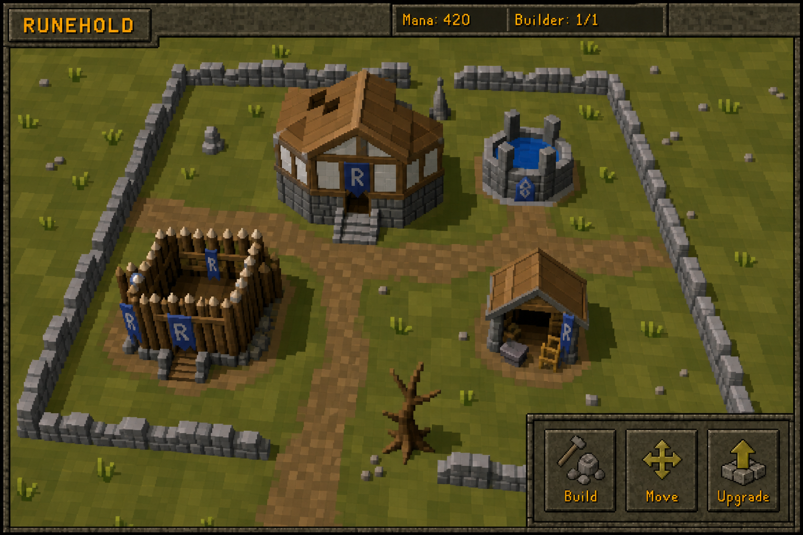
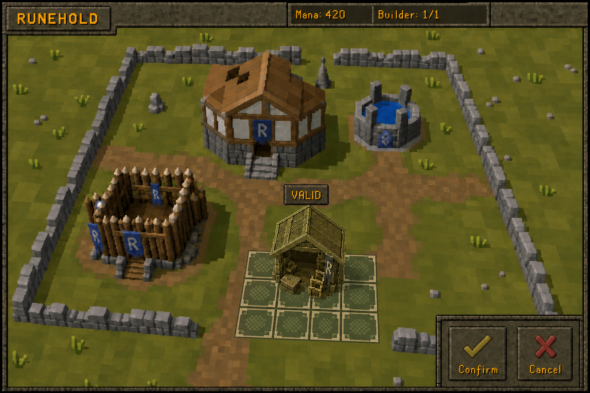

# Direction artistique OSRS 2007 de Runehold

## Références actives

### Vue du village

### Placement 3 x 3

Ces deux images remplacent `runehold-village-concept-v2.png` comme références de
production. L'ancien concept est conservé comme archive de recherche, mais son
rendu HD, sa lumière peinte et son interface 16:9 ne doivent plus être repris.

Les previews simulent un canvas natif de 768 x 512 affiché à 2x par nearest
neighbor. La hiérarchie fonctionnelle est normative; les pixels générés ne sont
pas des assets à découper ou à livrer tels quels.

## Signature visuelle

- Viewport de MMORPG Java de 2007, compact et volontairement limité.
- Géométrie très low-poly, facettes visibles et proportions légèrement gauches.
- Deux à quatre tons évidents par matériau du monde.
- Textures minuscules, texels visibles, sans PBR ni lumière réaliste.
- Ombres polygonales ou en aplats, sans ambient occlusion ni flou.
- Panneaux carrés en pierre brun-gris, bois sombre et bordures sculptées de 1 à
  3 pixels.
- Texte RuneScape jaune-orange avec ombre sombre dure d'un pixel.
- Aucun contour noir uniforme de style cartoon autour de toute la scène.

## Calibration par les corpus OSRS

`osrsbox-db` et `osrs-icons` ont été audités comme références de conception. Ils
ne sont pas des dépendances du plugin et aucun de leurs PNG n'est redistribué.

Mesures utilisées par le skill `osrs-2007-art-direction` :

- canevas d'icône d'inventaire : 36 x 32 pixels;
- alpha binaire uniquement dans l'échantillon inspecté;
- silhouette irrégulière occupant souvent moins de la moitié du canevas;
- palettes par matériau plus riches qu'un sprite 8-bit arbitraire : médiane de
  56 couleurs opaques sur l'échantillon de 500 icônes;
- contours sombres locaux et modelé en amas de pixels, pas outline uniforme.

Les icônes de catégorie rasterisées depuis des SVG Wiki ne servent pas de vérité
visuelle pour les sprites d'inventaire historiques.

## Interface réellement implémentée

Le panneau RuneLite utilise désormais une peau Swing originale dessinée par code :

- fond brun-noir `#1B1711`;
- cartes compactes à bordure de pierre carrée;
- boutons plats à biseau dur, sans gradient du Look & Feel système;
- ombre de texte dure d'un pixel;
- polices OSRS fournies par `FontManager`;
- emplacements naturels pour les icônes 36 x 32 fournies par `ItemManager`.

Les états verrouillé, abordable, insuffisant et niveau maximal restent exprimés
par texte en plus de leur couleur.

## Plan des sprites originaux

| Asset | Empreinte | Direction |
| --- | ---: | --- |
| Hôtel de ville | 4 x 4 | Pierre basse, pans de bois, grand toit angulaire, bannière Runehold. |
| Puits de mana | 2 x 2 | Cercle de pierre facetté, eau en trois bleus mats, rune originale. |
| Caserne | 3 x 3 | Palissade irrégulière, silhouette basse et ouverte. |
| Atelier | 3 x 3 | Abri simple, enclume et outils lisibles à petite échelle. |
| Chantier | selon bâtiment | Échafaudage rigide et poussière en aplats. |
| Constructeur | 1 x 1 visuel | Artisan original, proportions OSRS, sans ressembler au Builder de Clash. |

Le terrain, la grille et les motifs de validité sont dessinés par le canvas Swing.
Les bâtiments seront des PNG originaux produits à leur résolution d'utilisation,
sans extraction du cache Jagex.

## Frontière des assets

- `FontManager` fournit les polices du jeu à l'exécution.
- `ItemManager` ou `SpriteManager` fournissent les icônes Jagex nécessaires à
  l'exécution depuis le cache local de l'utilisateur.
- `osrsbox-db` sert uniquement à vérifier les noms et identifiants pendant la
  conception.
- `osrs-icons` sert uniquement de catalogue visuel non redistribué.
- Les bâtiments, le terrain, le constructeur, les emblèmes et les contrôles
  Runehold restent originaux.

## Contrôle d'acceptation

Une image est rejetée si elle contient du rendu HD, PBR, lumière douce, dégradé,
glow, géométrie lissée, carte arrondie, grande barre mobile, outline cartoon
uniforme ou asset reconnaissable copié. Les règles complètes et le prompt canonique
sont dans `.agents/skills/osrs-2007-art-direction/`.
